# Automatización del Proceso de Bartender  
## Proyecto Final – Robótica Industrial

**Curso:** Robótica Industrial  
**Universidad:** Universidad Nacional de Colombia  
**Año:** 2025  

**Integrantes del equipo:**
- Omar David Acosta Zambrano
- Ariadna Contreras Nossa  
- Esteban Duran Jiménez 
- David Santiago Nagles Barajas  
- Ana María Orozco Reyes 

---

## 1. Introducción

La automatización de procesos industriales se ha convertido en una herramienta clave para mejorar la eficiencia, la seguridad y la calidad en los sistemas de producción modernos. Actividades que tradicionalmente han sido realizadas de forma manual pueden beneficiarse significativamente del uso de robots industriales, especialmente cuando implican tareas repetitivas, manipulación de objetos variados y la necesidad de mantener condiciones higiénicas constantes. En este contexto, el proceso de bartender representa un caso de estudio interesante para la aplicación de tecnologías de automatización.

La preparación manual de cócteles depende en gran medida de la experiencia del operador, lo que puede generar variaciones en las cantidades, tiempos de preparación y calidad final de la bebida. Adicionalmente, el contacto humano directo con los ingredientes y utensilios puede incrementar el riesgo de contaminación, especialmente en entornos donde se exige un alto nivel de control sanitario. Por estas razones, la implementación de un sistema robotizado para la preparación de bebidas surge como una alternativa viable para garantizar precisión, repetibilidad y seguridad en el proceso.

Este proyecto presenta el desarrollo de un sistema robotizado para la automatización del proceso de bartender, integrando un manipulador industrial, una herramienta de agarre multipropósito, una barra de almacenamiento y una interfaz humano-máquina. A través del uso de simulación y programación, se busca demostrar cómo un proceso originalmente manual puede ser transformado en un sistema automatizado eficiente, manteniendo criterios de seguridad y funcionalidad acordes con un entorno industrial y académico.

---

## 2. Objetivos del Proyecto

### Objetivo general
Automatizar el proceso de preparación de un cóctel mediante un sistema robotizado industrial.

### Objetivos específicos
- Diseñar un gripper multipropósito accionado mediante sistemas electroneumáticos.
- Programar el manipulador industrial para la manipulación de diferentes implementos de bartender.
- Implementar una interfaz HMI para la selección de ingredientes.
- Modelar y simular el proceso en RobotStudio.


---

## 3. Descripción General de la Solución

El proyecto consiste en el diseño, implementación y simulación de una rutina de RobotStudio destinada a la automatización del proceso de preparación de un cóctel. El sistema está compuesto por un brazo manipulador industrial, una herramienta de agarre accionada mediante un sistema electroneumático, una estantería de almacenamiento con posiciones predefinidas para los ingredientes y una banda transportadora para el servido final de la bebida. Todos estos elementos se integran dentro de un entorno de simulación desarrollado en RobotStudio.

La barra de almacenamiento cuenta con seis posiciones posibles, identificadas como A1, A2, A3, B1, B2 y B3, en las cuales se ubican distintos ingredientes y utensilios de manera aleatoria al inicio de cada ciclo de operación. El sistema está diseñado para que el robot pueda interactuar con cualquiera de estas posiciones, lo que exige un diseño adecuado de las trayectorias y puntos de trabajo.

El proceso automatizado inicia con la selección del ingrediente por parte del usuario mediante una interfaz humano-máquina desarrollada con la herramienta ScreenMaker de RobotStudio. Una vez realizada la selección, el robot se desplaza hasta la posición correspondiente en la barra de almacenamiento, toma el objeto requerido utilizando el gripper multipropósito y lo traslada hasta la zona de preparación. Allí, el ingrediente es vertido en un jigger para su medición antes de ser añadido a la coctelera.

Este procedimiento se repite hasta completar la cantidad de ingredientes requerida para el cóctel. Posteriormente, el robot utiliza una cucharilla para realizar un mezclado inicial de los componentes dentro de la coctelera. Una vez finalizada esta etapa, se coloca la tapa de la coctelera y se ejecuta el movimiento de agitación, garantizando una mezcla homogénea de los ingredientes. Finalmente, el contenido es servido en una copa ubicada sobre una banda transportadora, concluyendo así el ciclo de preparación.

---

## 4. Objetos a Manipular

Durante el desarrollo del proyecto, el sistema robotizado está diseñado para manipular los siguientes objetos:

- Coctelera
<p align="center">  </p> <p align="center"><em>Imagen de la coctelera utilizada para la mezcla y batido de los ingredientes del cóctel.</em></p>
 
- Jigger
<p align="center">  </p> <p align="center"><em>Jigger empleado para la medición precisa de las cantidades de líquido en cada preparación.</em></p>


- Cucharilla
<p align="center">  </p> <p align="center"><em>Cucharilla utilizada para el mezclado inicial de los ingredientes dentro de la coctelera.</em></p>


- Envases de ingredientes
<p align="center">  </p> <p align="center"><em>Botellas que contienen los distintos ingredientes líquidos empleados en el proceso de preparación.</em></p>


- Copa para servido final
<p align="center">  </p> <p align="center"><em>Copa destinada al servido final del cóctel una vez completado el proceso automatizado.</em></p>


Estos objetos presentan diferentes geometrías y tamaños, lo que representa un reto para el diseño de la herramienta de agarre.

---

## 5. Diseño de la Herramienta Multi-Propósito (Gripper)

➡️ [Ver gripper diseñado en:](https://www.youtube.com/watch?v=7g1MrlTEaAY)
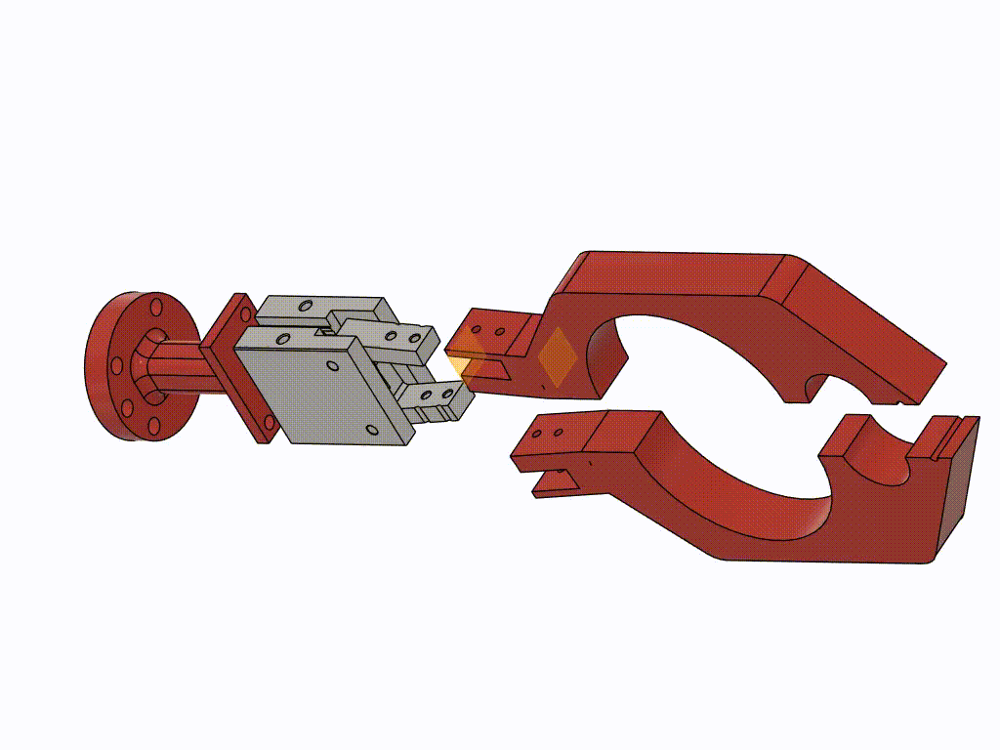

Se diseñó un gripper personalizado accionado mediante un sistema electroneumático, empleando un cilindro neumático para gripper, disponible en el laboratorio. Este sistema permite el control preciso de la apertura y el cierre del gripper, garantizando un funcionamiento confiable durante todo el proceso automatizado. El diseño del gripper fue pensado para adaptarse a los distintos implementos utilizados en el proceso de bartender, sin necesidad de realizar cambios mecánicos entre ciclos de operación.

El gripper cuenta con un orificio principal de mayor tamaño, destinado a la manipulación de objetos de mayor volumen como las botellas, el vaso y la coctelera. Adicionalmente, incorpora un orificio secundario de menor tamaño, diseñado específicamente para la sujeción del jigger, así como una superficie recta que permite el agarre adecuado de la cucharilla. Esta configuración facilita la manipulación de objetos con diferentes geometrías utilizando una única herramienta.

<p align="center">  </p> <p align="center"><em>Plano del gripper donde se aprecian las dimensiones.</em></p>


El diseño del gripper fue concebido para garantizar un agarre seguro, repetible y estable, minimizando el riesgo de deslizamiento o caída de los objetos durante la manipulación. Asimismo, su geometría y sistema de accionamiento permiten una fácil instalación sobre los robots disponibles en el laboratorio, sin requerir modificaciones ni el desmontaje del sistema neumático existente.


---

## 6. Alistamiento del Sistema
<p align="center"> 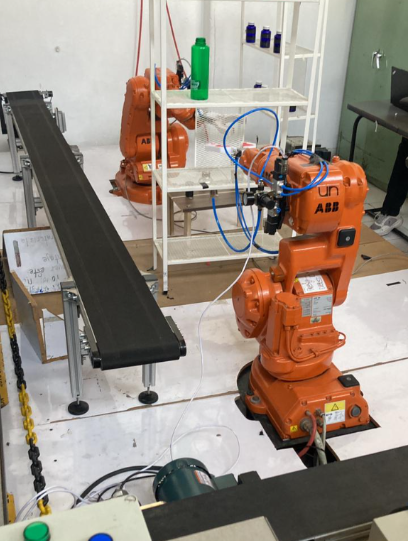 </p> <p align="center"><em>Montaje real del sistema robotizado.</em></p>

La barra de almacenamiento del sistema automatizado se modela como una estantería con seis posiciones claramente definidas, distribuidas en tres niveles, con dos posiciones ubicadas en cada uno de ellos. Esta configuración se adoptó de manera intencional y no se implementó un arreglo de tres posiciones en dos niveles, ya que el gripper del robot presenta un ancho considerable y no dispone del espacio suficiente para tomar tres botellas ubicadas en un mismo nivel sin riesgo de colisión con los objetos adyacentes o con la propia estructura de la estantería.

Esta disposición permite representar de manera estructurada y segura el almacenamiento de los diferentes ingredientes utilizados en la preparación de las bebidas, garantizando accesos libres de interferencias durante la operación del manipulador. Al inicio de cada ciclo de operación, los ingredientes se ubican en estas posiciones, manteniendo la misma distribución a lo largo de todo el proceso automatizado.

Previo a la ejecución de las rutinas automáticas, se realizaron diversas pruebas experimentales utilizando el gripper como herramienta del robot. Estas pruebas tuvieron como objetivo evaluar si la posición y orientación del gripper resultaban adecuadas para llevar a cabo la rutina completa de preparación del cóctel, así como verificar su capacidad para recoger de manera segura y repetible todos los objetos necesarios, tales como botellas, jigger, cucharilla y coctelera. A partir de estas evaluaciones se comprobó que el gripper permitía una sujeción estable de los distintos elementos, sin comprometer la precisión de los movimientos ni la seguridad del sistema durante la operación.

Adicionalmente, se llevó a cabo la medición y el modelamiento detallado de todos los elementos involucrados en el proceso, incluyendo la barra de almacenamiento, los ingredientes y los utensilios utilizados. Estas mediciones fueron fundamentales para recrear con fidelidad cada objeto dentro del entorno de simulación de RobotStudio. Con los modelos correctamente dimensionados y posicionados dentro del espacio de trabajo del manipulador, fue posible definir de manera precisa los targets y las trayectorias del robot, asegurando que los movimientos simulados coincidieran con el comportamiento esperado en una implementación real.

---

## 7. Implementación física del proceso
A continuación, dé click en la imagen para ver el video:

[](https://www.youtube.com/watch?v=OSdnihtZNg4)

El proceso automatizado de preparación del cóctel se desarrolla siguiendo una secuencia ordenada y repetible que garantiza precisión, seguridad y consistencia en cada bebida elaborada. Inicialmente, el usuario interactúa con la interfaz HMI para seleccionar el ingrediente deseado, lo que permite al sistema identificar la ubicación exacta del mismo dentro de la barra de almacenamiento. A continuación, el robot ejecuta la toma controlada del ingrediente seleccionado, asegurando una manipulación estable y precisa. 

<p align="center"> 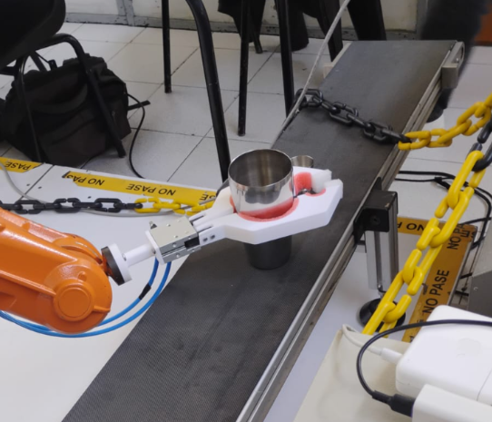 </p> <p align="center"><em>Secuencia en la que el robot toma el vaso de la coctelera usado para mezclar las bebidas.</em></p>

Posteriormente, el líquido es vertido en el jigger, donde se realiza la medición exacta de la cantidad requerida, evitando errores en la dosificación. Una vez medida, la porción es añadida a la coctelera, donde se van incorporando progresivamente los diferentes ingredientes seleccionados. 

<p align="center"> 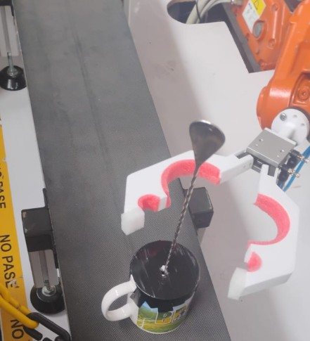 </p> <p align="center"><em>Manipulación de la cucharilla por parte del robot para realizar el mezclado de los ingredientes.</em></p>

Tras la adición de varios componentes, se lleva a cabo un mezclado inicial mediante una cucharilla para homogeneizar la mezcla. Seguidamente, la coctelera es agitada de forma automática durante un tiempo determinado, permitiendo una correcta integración de los sabores. Finalmente, el sistema procede al servido del cóctel en la copa final, completando el ciclo de preparación de manera eficiente y garantizando un resultado uniforme en cada ejecución.

<p align="center"> 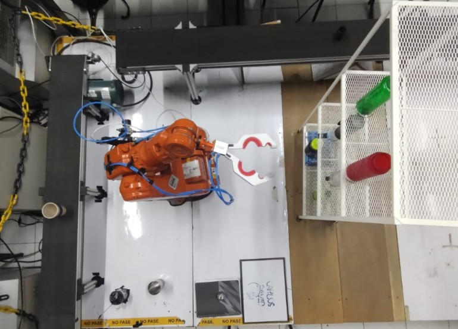 </p> <p align="center"><em>Plano de planta de los elementos.</em></p>

---

## 8. Interfaz Humano-Máquina (HMI)

La interfaz hombre–máquina (HMI) fue desarrollada utilizando la herramienta ScreenMaker de RobotStudio, la cual permitió diseñar un entorno gráfico intuitivo y funcional para la interacción entre el usuario y el sistema automatizado. En la pestaña principal de la interfaz se dispusieron seis bebidas alcohólicas, cada una representada mediante su imagen correspondiente, lo que facilita su identificación visual y mejora la experiencia de uso del sistema.
<p align="center">  </p> <p align="center"><em>Pantalla principal de la HMI donde el usuario selecciona las bebidas a preparar.</em></p>

Cada bebida está asociada a una repisa específica del sistema, de modo que, al seleccionar una opción, el usuario indica de forma directa desde cuál posición se tomará el ingrediente requerido. Adicionalmente, en esta misma pantalla se incorporó un contador de selección, el cual permite que el usuario elija hasta tres bebidas en una misma operación, asegurando que el sistema controle correctamente el número de selecciones realizadas antes de habilitar la siguiente etapa del proceso.
<p align="center">  </p> <p align="center"><em>Pantalla de preparación que indica el proceso en curso.</em></p>

Una vez completadas las tres selecciones, el usuario puede proceder a presionar la opción “Preparar bebida”, lo que da inicio al ciclo automático del sistema. Durante la ejecución del proceso, la HMI muestra una pantalla de interludio, acompañada de una imagen representativa, cuya función es informar al usuario que la bebida se encuentra en proceso de preparación, evitando así interacciones no deseadas mientras el sistema se encuentra en operación.
<p align="center">  </p> <p align="center"><em>Pantalla final de confirmación que informa al usuario que la bebida ha sido preparada exitosamente.</em></p>

Al finalizar el ciclo de preparación, la interfaz despliega una imagen final de confirmación, indicando de manera clara que la bebida ha sido preparada exitosamente y se encuentra lista, también se presenta la opción de reiniciar el proceso y preparar otra bebida. Esta retroalimentación visual permite al usuario identificar el estado final del proceso sin ambigüedades, mejorando la comunicación entre el sistema robotizado y el operador.

En conjunto, la HMI no solo permite seleccionar las repisas y bebidas de manera eficiente, sino que también ofrece una visualización clara del estado del proceso y de las posiciones utilizadas durante cada ciclo de operación. Esto contribuye significativamente a la usabilidad, seguridad y control del sistema, garantizando una interacción fluida y confiable entre el usuario y la rutina de RobotStudio.

### Diagrama de flujo
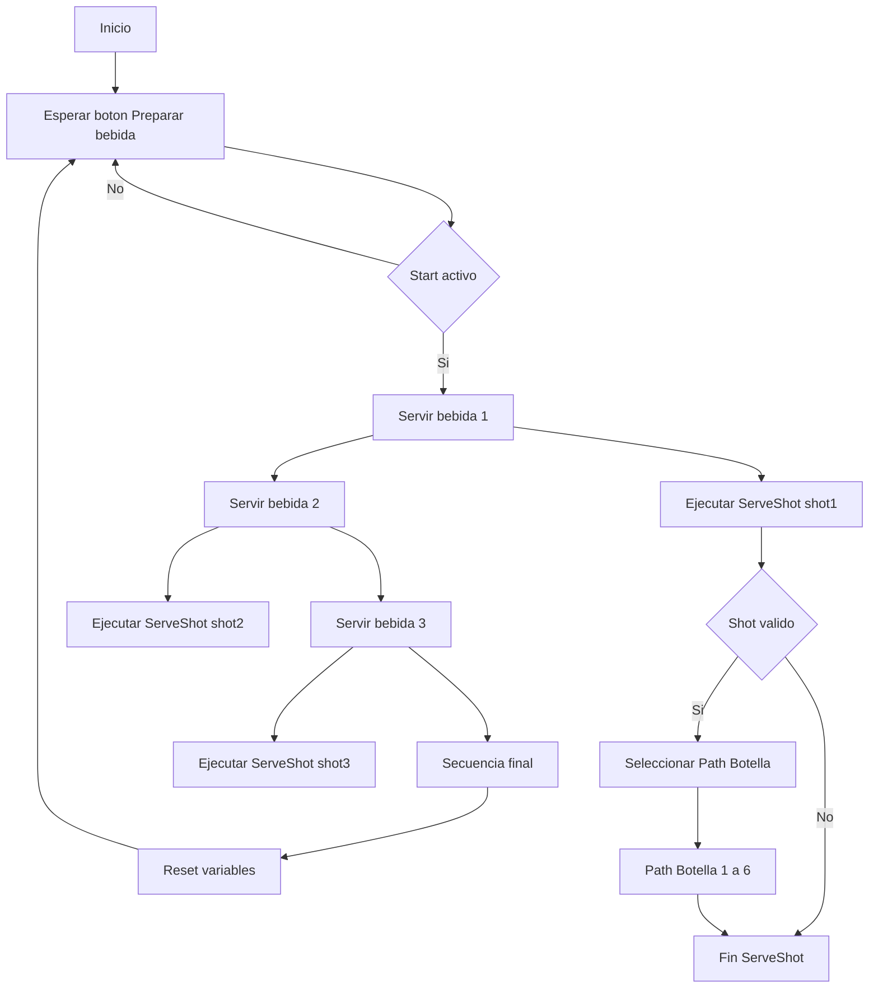

El proceso espera la activación del botón Preparar bebida; cuando está activo, sirve tres bebidas en secuencia. Para cada bebida se ejecuta el procedimiento ServeShot, donde se valida el valor del shot y, si es válido, se selecciona la trayectoria correspondiente de la botella. Al finalizar, el sistema ejecuta una secuencia final, reinicia las variables y vuelve al estado de espera para una nueva operación.

---

## 9. Simulación en RobotStudio
<p align="center"> 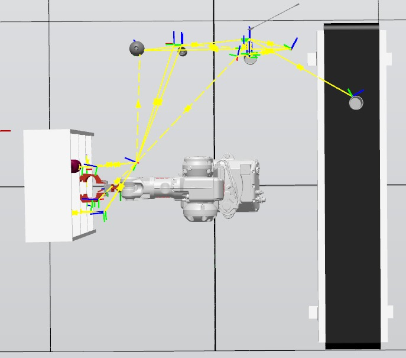 </p> <p align="center"><em>Plano de planta de los elementos de la simulación.</em></p>

La simulación del sistema automatizado se llevó a cabo en el software ABB RobotStudio, utilizando un entorno virtual que replica las condiciones reales de operación del robot industrial. En este entorno se importó el modelo del robot, junto con los elementos del proceso, tales como botellas, jigger, coctelera, utensilios de mezclado y el área de trabajo. El objetivo principal de la simulación fue validar la lógica del programa RAPID, comprobar la correcta secuencia de movimientos y garantizar la ausencia de colisiones antes de una posible implementación física.

Durante la simulación se verificó el funcionamiento del procedimiento principal (main), el cual actúa como controlador del flujo general del sistema. En esta etapa se confirmó que el programa permite la ejecución flexible de uno o varios procedimientos Path_Botella(i), según la selección realizada, sin requerir una secuencia fija de las seis botellas disponibles. Esta lógica condicional fue correctamente representada en la simulación, permitiendo observar cómo el robot ejecuta únicamente los trayectos necesarios antes de continuar con las etapas posteriores del proceso.

Cada uno de los procedimientos Path_Botella(i) fue simulado de manera individual, comprobando que el robot se desplaza primero a posiciones seguras, accede a la botella correspondiente, realiza la sujeción mediante la pinza y efectúa el vertido controlado del líquido en la coctelera. En RobotStudio se validó que las trayectorias programadas evitan interferencias con otros elementos del entorno y mantienen una orientación adecuada de la herramienta durante el proceso de dosificación.

Una vez finalizada la fase de adición de ingredientes, se simuló el procedimiento Path_revolver, en el cual el robot toma el utensilio de mezclado y ejecuta movimientos controlados sobre la coctelera. En esta etapa se verificó que las trayectorias circulares y los puntos de aproximación permiten una mezcla adecuada sin generar colisiones ni movimientos bruscos, asegurando un comportamiento estable del robot dentro del espacio de trabajo.

Posteriormente, se ejecutó el procedimiento Path_batir, encargado de simular el cierre de la coctelera, el proceso de agitado y el servido final de la bebida. La simulación permitió confirmar que la secuencia de movimientos es coherente, continua y segura, y que las transiciones entre posiciones están correctamente definidas para evitar esfuerzos innecesarios en el manipulador.

Finalmente, se validó el procedimiento GoHome, el cual retorna el robot a su posición de origen una vez finalizado el ciclo completo. Esta etapa es fundamental para dejar el sistema en un estado seguro y preparado para un nuevo ciclo de operación. En RobotStudio se comprobó que el robot alcanza la posición home sin interferencias y respetando las condiciones de seguridad establecidas.
<p align="center"> 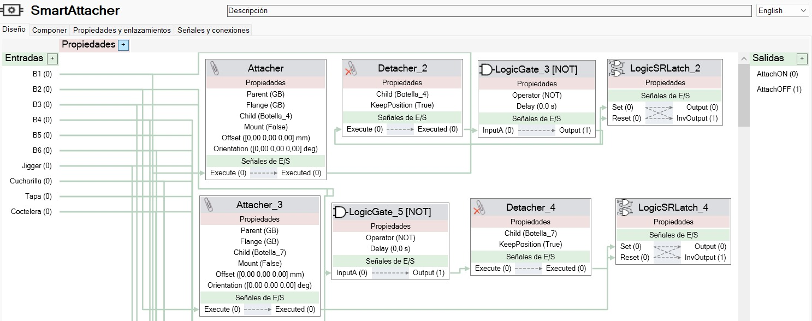 </p> <p align="center"><em>Smart Component usado en simulación.</em></p>

En conclusión, la simulación en RobotStudio permitió validar de manera efectiva la lógica del programa RAPID, la correcta ejecución de los distintos procedimientos y la viabilidad del proceso automatizado. Esta etapa resultó clave para detectar posibles errores de secuencia, optimizar trayectorias y garantizar un funcionamiento seguro y eficiente del sistema antes de su implementación en un entorno real.
<p align="center">  </p> <p align="center"><em>Smart Component usado en simulación.</em></p>

### Video de simulación
A continuación, dé click en la imagen para ver el video:


[](https://www.youtube.com/watch?v=pXSyhm7AOjs)


A continuación, dé click en la imagen para ver el video:


[](https://www.youtube.com/watch?v=9EYyWyW5B4Q)

### Diagramas de flujo
#### Diagrama general

```mermaid
    flowchart TD
    A([Inicio]) --> B[Inicialización del sistema]

    B --> C{¿Hay botella seleccionada?}

    C -->|Sí| D[Ejecutar Path_Botella i]
    C -->|No| E[Path_revolver]

    D --> F{¿Hay otra botella seleccionada y menos de 3 bebidas ya seleccionadas?}

    F -->|Sí| D
    F -->|No| E

    E --> G[Path_batir]
    G --> H[GoHome]
    H --> I([Fin])

````
El diagrama de flujo representa la lógica general de operación del sistema automatizado para la preparación de bebidas. El proceso inicia con la inicialización del sistema, tras lo cual se verifica si existe una botella seleccionada. En caso afirmativo, se ejecuta el procedimiento correspondiente al trayecto de la botella (Path_Botella i). Finalizada esta acción, el sistema evalúa si hay otra botella seleccionada y si aún no se ha alcanzado el límite de tres bebidas; de cumplirse esta condición, el proceso de selección y ejecución de botellas se repite. Cuando no hay más botellas por procesar o se alcanza el límite establecido, el sistema continúa con el procedimiento de mezclado (Path_revolver), seguido del batido (Path_batir). Finalmente, el robot retorna a su posición inicial mediante GoHome, dando por concluido el ciclo de operación.

#### Path_Botella i

```mermaid
    flowchart TD
    A([Inicio Path_Botella]) --> B[Mover a posición segura]
    B --> C[Abrir pinza]
    C --> D[Tomar botella]
    D --> E[Cerrar pinza]
    E --> F[Ir al jigger]
    F --> G[Dosificar líquido]
    G --> H[Servir sobre coctelera]
    H --> I[Soltar botella]
    I --> J[Regresar a posición segura]
    J --> K([Fin Path_Botella])

```
El diagrama de flujo muestra la secuencia de funcionamiento del sistema, comenzando con la inicialización y la verificación de botellas seleccionadas. El robot ejecuta uno o varios trayectos de botellas, con un máximo de tres, y posteriormente realiza los procesos de mezclado y batido. Finalmente, el sistema retorna a la posición inicial, concluyendo el ciclo de operación.

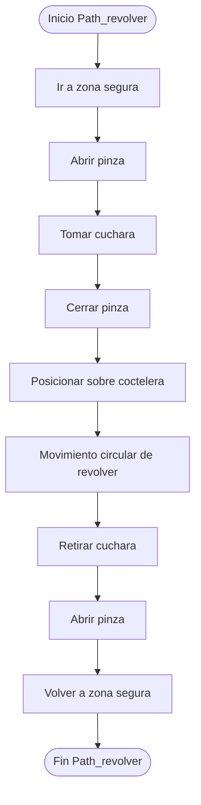

Este diagrama de flujo describe el proceso mediante el cual el robot se desplaza a una posición segura, toma la cuchara de mezclado y la posiciona sobre la coctelera. A continuación, ejecuta los movimientos necesarios para realizar el mezclado del contenido y, una vez finalizado, retira la cuchara y la devuelve a su ubicación, dejando el sistema listo para la siguiente etapa.

#### Path_batir:
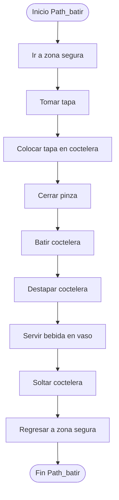

El diagrama representa la secuencia en la que el robot toma la tapa de la coctelera, la coloca correctamente y realiza el proceso de batido. Posteriormente, destapa la coctelera y sirve la bebida en el vaso correspondiente, asegurando un flujo continuo y ordenado del proceso.

#### GoHome:
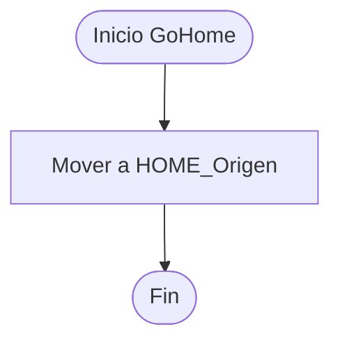

Este diagrama de flujo muestra el retorno del robot a su posición de origen una vez finalizadas todas las operaciones. Esta acción garantiza que el sistema quede en un estado seguro y preparado para iniciar un nuevo ciclo de trabajo.


---

## 10. Video de Presentación

El video de presentación del proyecto se encuentra en el siguiente link: https://drive.google.com/drive/folders/1IVio0eSMy9uFiXIniwHXzH0S-tmAQply?usp=sharing

**VIDEO PRESENTACIÓN DEL PROYECTO**
[](https://www.youtube.com/watch?v=LpkxrvMzsmY)


## Presentación de diapositivas del proyecto
La presentación del proyecto se encuentra en el siguiente link: https://drive.google.com/file/d/1RpUhUtWlBcLKKDA91ukVLIFzKmLBNA_V/view?usp=sharing
[📄 Ver informe final](Imágenes/Presentación_Automatización.pdf)

---

## Inconvenientes Presentados en el Desarrollo del Proyecto

-El gripper angular con el que se contaba en el laboratorio tenia unos adaptadores antiguos, por lo que se decidio cambiarlos, no se contaba con las mangueras necesarias y las compramos, adicionalmente se compraron los acoples para las valvulas.

-Debido al diseño de gripper que hicimos y a las botellas usadas, se  posicionaron  siguiendo una matriz de 3x2, porque de lo contrario de haberlo hecho 2x3, el espacio de la estanteria hubiese chocado con el espacio que ocupaba el gripper al recoger las botellas. Lo anterior generó tener que llegar a las posiciones inferiores ampliando el rango de operación del robot.

<p align="center">  </p> <p align="center"><em>Soporte del gripper dañado como consecuencia de la fatiga del material.</em></p>

-Durante la implementación física de la rutina desarrollada para el cumplimiento del proyecto se presentó un inconveniente que impidió la continuación normal de las pruebas experimentales. En particular, el soporte del gripper, componente encargado de unir el flange del robot con el cilindro neumático de doble efecto utilizado para el accionamiento de la herramienta, sufrió una falla estructural y se rompió durante la ejecución del sistema.

Tras el análisis del evento, se determinó que la falla ocurrió como consecuencia de un proceso de fatiga del material. Este fenómeno se vio favorecido por las cargas repetitivas generadas durante los ciclos de apertura y cierre del gripper, así como por las fuerzas ejercidas durante la manipulación de los distintos implementos del proceso de bartender. La combinación de estos factores provocó el debilitamiento progresivo del soporte hasta su fractura.

Como posible solución a este inconveniente, se identificó que la rotura del soporte podría haberse reparado mediante el uso de un adhesivo estructural de poliuretano, específicamente el pegante Indupeg 0419, el cual ofrece buenas propiedades de adherencia y resistencia mecánica para este tipo de aplicaciones. Sin embargo, debido a las limitaciones de tiempo asociadas a la fecha de entrega del proyecto, no fue posible realizar dicha reparación ni llevar a cabo las pruebas necesarias para validar su efectividad, por lo que se optó por no continuar con la implementación física y concentrar los esfuerzos en la simulación del sistema.

---
## 11. Aprendizajes y Consideraciones

Este proyecto resultó ser bastante retador, ya que requirió la inversión de varios días de trabajo continuo y la superación de diversos obstáculos a lo largo de su desarrollo. Entre las principales dificultades enfrentadas se encontró la adquisición del sistema neumático, el cual no estaba disponible en el laboratorio, así como la rotura del gripper durante las pruebas, lo que obligó a replantear algunas decisiones de diseño. Adicionalmente, la limitada disponibilidad de tiempo para dedicar al proyecto representó un reto importante; sin embargo, a pesar de estas restricciones, todos los integrantes del equipo participaron activamente en las distintas etapas, incluyendo el diseño del sistema, la elaboración de utensilios, la programación de rutinas y la documentación del proyecto. Otro aspecto relevante fue la dificultad para acceder de manera constante al laboratorio, razón por la cual extendemos un especial agradecimiento a nuestro monitor Johan López Arias, quien nos brindó su tiempo y apoyo para permitirnos el uso del laboratorio cuando fue posible. Finalmente, se considera que, de haber contado con un mayor margen de tiempo, el alcance y la calidad del proyecto podrían haberse mejorado aún más, reforzando así los aprendizajes obtenidos durante su desarrollo.

---

## 12. Referencias

- ABB Robotics. (2023). RobotStudio: Manual de usuario y guía de desarrollo de interfaces HMI con ScreenMaker. ABB Group.
