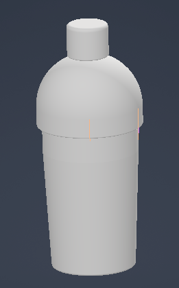
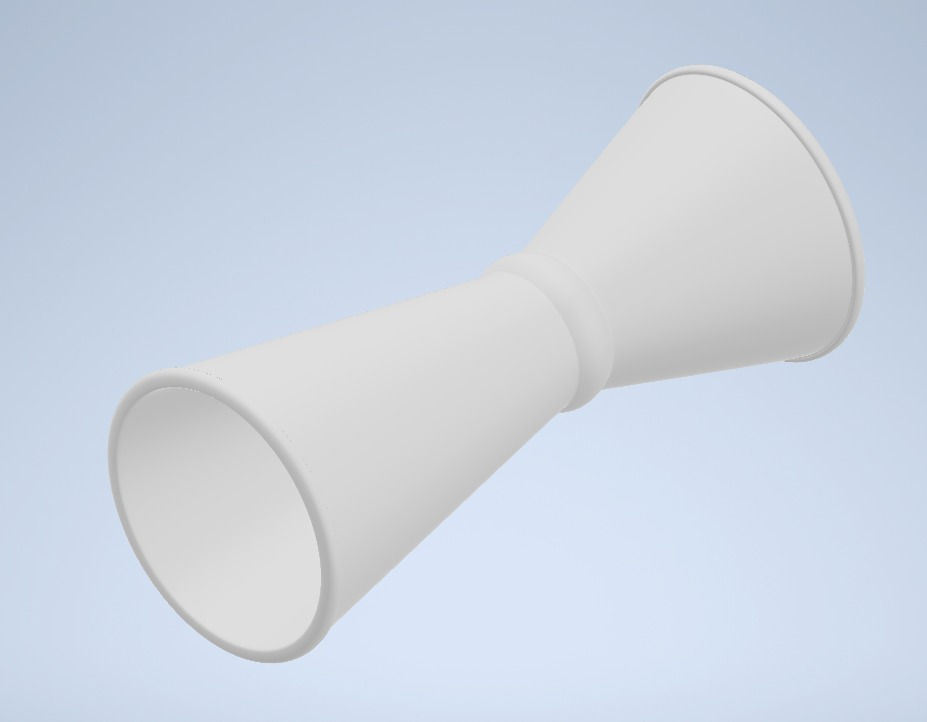
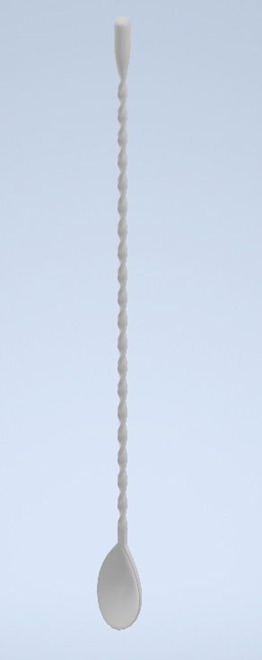
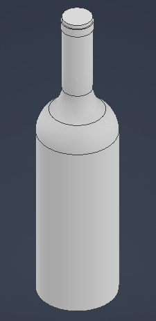
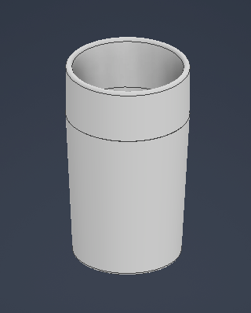
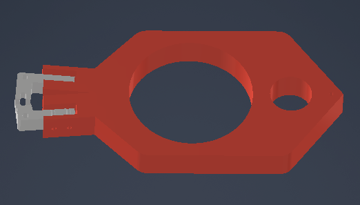
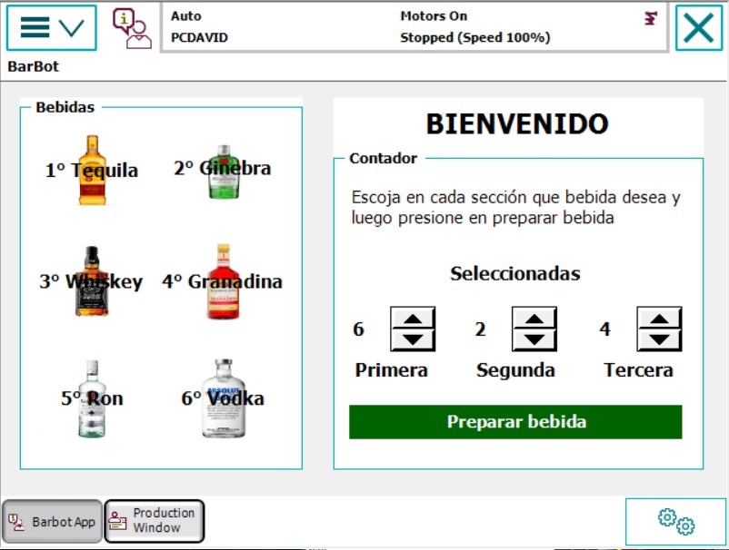
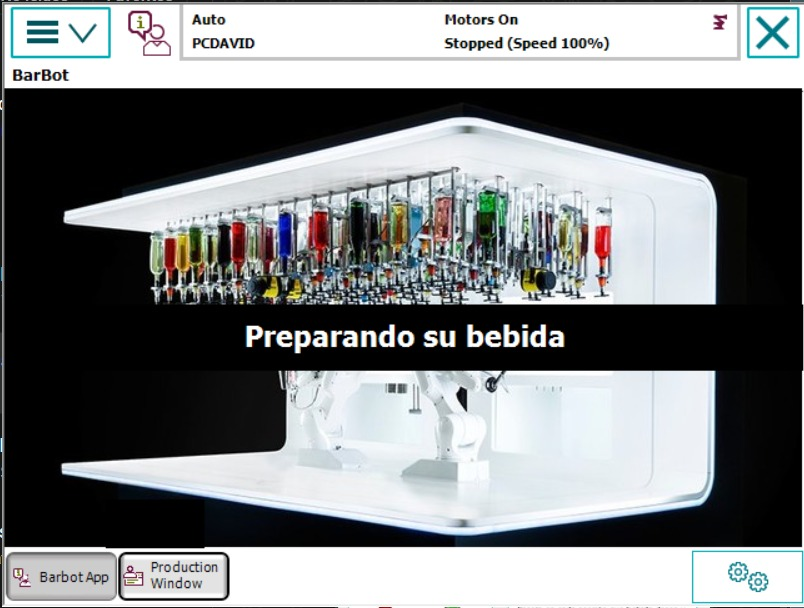

# Automatización del Proceso de Bartender  
## Proyecto Final – Robótica Industrial

**Curso:** Robótica Industrial  
**Universidad:** Universidad Nacional de Colombia  
**Año:** 2025  

**Integrantes del equipo:**
- Omar David Acosta Zambrano
- Ariadna Contreras Nossa  
- Esteban Duran Jiménez 
- David Santiago Nagles Barajas  
- Ana María Orozco Reyes 

---

## 1. Introducción

La automatización de procesos industriales se ha convertido en una herramienta clave para mejorar la eficiencia, la seguridad y la calidad en los sistemas de producción modernos. Actividades que tradicionalmente han sido realizadas de forma manual pueden beneficiarse significativamente del uso de robots industriales, especialmente cuando implican tareas repetitivas, manipulación de objetos variados y la necesidad de mantener condiciones higiénicas constantes. En este contexto, el proceso de bartender representa un caso de estudio interesante para la aplicación de tecnologías de automatización.

La preparación manual de cócteles depende en gran medida de la experiencia del operador, lo que puede generar variaciones en las cantidades, tiempos de preparación y calidad final de la bebida. Adicionalmente, el contacto humano directo con los ingredientes y utensilios puede incrementar el riesgo de contaminación, especialmente en entornos donde se exige un alto nivel de control sanitario. Por estas razones, la implementación de un sistema robotizado para la preparación de bebidas surge como una alternativa viable para garantizar precisión, repetibilidad y seguridad en el proceso.

Este proyecto presenta el desarrollo de un sistema robotizado para la automatización del proceso de bartender, integrando un manipulador industrial, una herramienta de agarre multipropósito, una barra de almacenamiento y una interfaz humano-máquina. A través del uso de simulación y programación, se busca demostrar cómo un proceso originalmente manual puede ser transformado en un sistema automatizado eficiente, manteniendo criterios de seguridad y funcionalidad acordes con un entorno industrial y académico.

---

## 2. Objetivos del Proyecto

### Objetivo general
Automatizar el proceso de preparación de un cóctel mediante un sistema robotizado industrial.

### Objetivos específicos
- Diseñar un gripper multipropósito accionado mediante sistemas electroneumáticos.
- Programar el manipulador industrial para la manipulación de diferentes implementos de bartender.
- Implementar una interfaz HMI para la selección de ingredientes.
- Modelar y simular el proceso en RobotStudio.

---

## 3. Descripción General de la Solución

El proyecto consiste en el diseño, implementación y simulación de una celda robotizada destinada a la automatización del proceso de preparación de un cóctel. El sistema está compuesto por un brazo manipulador industrial, una herramienta de agarre accionada mediante un sistema electroneumático, una estantería de almacenamiento con posiciones predefinidas para los ingredientes y una banda transportadora para el servido final de la bebida. Todos estos elementos se integran dentro de un entorno de simulación desarrollado en RobotStudio.

La barra de almacenamiento cuenta con seis posiciones posibles, identificadas como A1, A2, A3, B1, B2 y B3, en las cuales se ubican distintos ingredientes y utensilios de manera aleatoria al inicio de cada ciclo de operación. El sistema está diseñado para que el robot pueda interactuar con cualquiera de estas posiciones, lo que exige un diseño adecuado de las trayectorias y puntos de trabajo.

El proceso automatizado inicia con la selección del ingrediente por parte del usuario mediante una interfaz humano-máquina desarrollada con la herramienta ScreenMaker de RobotStudio. Una vez realizada la selección, el robot se desplaza hasta la posición correspondiente en la barra de almacenamiento, toma el objeto requerido utilizando el gripper multipropósito y lo traslada hasta la zona de preparación. Allí, el ingrediente es vertido en un jigger para su medición antes de ser añadido a la coctelera.

Este procedimiento se repite hasta completar la cantidad de ingredientes requerida para el cóctel. Posteriormente, el robot utiliza una cucharilla para realizar un mezclado inicial de los componentes dentro de la coctelera. Una vez finalizada esta etapa, se coloca la tapa de la coctelera y se ejecuta el movimiento de agitación, garantizando una mezcla homogénea de los ingredientes. Finalmente, el contenido es servido en una copa ubicada sobre una banda transportadora, concluyendo así el ciclo de preparación.

---

## 4. Objetos a Manipular

Durante el desarrollo del proyecto, el sistema robotizado está diseñado para manipular los siguientes objetos:

- Coctelera

  

 
- Jigger

  

- Cucharilla

  

- Envases de ingredientes

  

- Copa para servido final

  

Estos objetos presentan diferentes geometrías y tamaños, lo que representa un reto para el diseño de la herramienta de agarre.

---

## 5. Desarrollo de la Herramienta Multi-Propósito (Gripper)

  

Se diseñó un gripper personalizado accionado mediante un sistema electroneumático, empleando un cilindro neumático para gripper, disponible en el laboratorio. Este sistema permite el control preciso de la apertura y el cierre del gripper, garantizando un funcionamiento confiable durante todo el proceso automatizado. El diseño del gripper fue pensado para adaptarse a los distintos implementos utilizados en el proceso de bartender, sin necesidad de realizar cambios mecánicos entre ciclos de operación.

El gripper cuenta con un orificio principal de mayor tamaño, destinado a la manipulación de objetos de mayor volumen como las botellas, el vaso y la coctelera. Adicionalmente, incorpora un orificio secundario de menor tamaño, diseñado específicamente para la sujeción del jigger, así como una superficie recta que permite el agarre adecuado de la cucharilla. Esta configuración facilita la manipulación de objetos con diferentes geometrías utilizando una única herramienta.

  

El diseño del gripper fue concebido para garantizar un agarre seguro, repetible y estable, minimizando el riesgo de deslizamiento o caída de los objetos durante la manipulación. Asimismo, su geometría y sistema de accionamiento permiten una fácil instalación sobre los robots disponibles en el laboratorio, sin requerir modificaciones ni el desmontaje del sistema neumático existente.

---

## 6. Alistamiento del Sistema

La barra de almacenamiento del sistema automatizado se modela como una estantería con seis posiciones claramente definidas, distribuidas en tres niveles, con dos posiciones ubicadas en cada uno de ellos. Esta configuración se adoptó de manera intencional y no se implementó un arreglo de tres posiciones en dos niveles, ya que el gripper del robot presenta un ancho considerable y no dispone del espacio suficiente para tomar tres botellas ubicadas en un mismo nivel sin riesgo de colisión con los objetos adyacentes o con la propia estructura de la estantería.

Esta disposición permite representar de manera estructurada y segura el almacenamiento de los diferentes ingredientes utilizados en la preparación de las bebidas, garantizando accesos libres de interferencias durante la operación del manipulador. Al inicio de cada ciclo de operación, los ingredientes se ubican en estas posiciones, manteniendo la misma distribución a lo largo de todo el proceso automatizado.

Previo a la ejecución de las rutinas automáticas, se realizaron diversas pruebas experimentales utilizando el gripper como herramienta del robot. Estas pruebas tuvieron como objetivo evaluar si la posición y orientación del gripper resultaban adecuadas para llevar a cabo la rutina completa de preparación del cóctel, así como verificar su capacidad para recoger de manera segura y repetible todos los objetos necesarios, tales como botellas, jigger, cucharilla y coctelera. A partir de estas evaluaciones se comprobó que el gripper permitía una sujeción estable de los distintos elementos, sin comprometer la precisión de los movimientos ni la seguridad del sistema durante la operación.

Adicionalmente, se llevó a cabo la medición y el modelamiento detallado de todos los elementos involucrados en el proceso, incluyendo la barra de almacenamiento, los ingredientes y los utensilios utilizados. Estas mediciones fueron fundamentales para recrear con fidelidad cada objeto dentro del entorno de simulación de RobotStudio. Con los modelos correctamente dimensionados y posicionados dentro del espacio de trabajo del manipulador, fue posible definir de manera precisa los targets y las trayectorias del robot, asegurando que los movimientos simulados coincidieran con el comportamiento esperado en una implementación real.

---

## 7. Proceso Automatizado

El proceso automatizado de preparación del cóctel se desarrolla siguiendo una secuencia ordenada y repetible que garantiza precisión, seguridad y consistencia en cada bebida elaborada. Inicialmente, el usuario interactúa con la interfaz HMI para seleccionar el ingrediente deseado, lo que permite al sistema identificar la ubicación exacta del mismo dentro de la barra de almacenamiento. A continuación, el robot ejecuta la toma controlada del ingrediente seleccionado, asegurando una manipulación estable y precisa. Posteriormente, el líquido es vertido en el jigger, donde se realiza la medición exacta de la cantidad requerida, evitando errores en la dosificación. Una vez medida, la porción es añadida a la coctelera, donde se van incorporando progresivamente los diferentes ingredientes seleccionados. Tras la adición de varios componentes, se lleva a cabo un mezclado inicial mediante una cucharilla para homogeneizar la mezcla. Seguidamente, la coctelera es agitada de forma automática durante un tiempo determinado, permitiendo una correcta integración de los sabores. Finalmente, el sistema procede al servido del cóctel en la copa final, completando el ciclo de preparación de manera eficiente y garantizando un resultado uniforme en cada ejecución.

---

## 8. Interfaz Humano-Máquina (HMI)

La interfaz hombre–máquina (HMI) fue desarrollada utilizando la herramienta ScreenMaker de RobotStudio, la cual permitió diseñar un entorno gráfico intuitivo y funcional para la interacción entre el usuario y el sistema automatizado. En la pestaña principal de la interfaz se dispusieron seis bebidas alcohólicas, cada una representada mediante su imagen correspondiente, lo que facilita su identificación visual y mejora la experiencia de uso del sistema.

  

Cada bebida está asociada a una repisa específica del sistema, de modo que, al seleccionar una opción, el usuario indica de forma directa desde cuál posición se tomará el ingrediente requerido. Adicionalmente, en esta misma pantalla se incorporó un contador de selección, el cual permite que el usuario elija hasta tres bebidas en una misma operación, asegurando que el sistema controle correctamente el número de selecciones realizadas antes de habilitar la siguiente etapa del proceso.

  

Una vez completadas las tres selecciones, el usuario puede proceder a presionar la opción “Preparar bebida”, lo que da inicio al ciclo automático del sistema. Durante la ejecución del proceso, la HMI muestra una pantalla de interludio, acompañada de una imagen representativa, cuya función es informar al usuario que la bebida se encuentra en proceso de preparación, evitando así interacciones no deseadas mientras el sistema se encuentra en operación.

  

Al finalizar el ciclo de preparación, la interfaz despliega una imagen final de confirmación, indicando de manera clara que la bebida ha sido preparada exitosamente y se encuentra lista. Esta retroalimentación visual permite al usuario identificar el estado final del proceso sin ambigüedades, mejorando la comunicación entre el sistema robotizado y el operador.

En conjunto, la HMI no solo permite seleccionar las repisas y bebidas de manera eficiente, sino que también ofrece una visualización clara del estado del proceso y de las posiciones utilizadas durante cada ciclo de operación. Esto contribuye significativamente a la usabilidad, seguridad y control del sistema, garantizando una interacción fluida y confiable entre el usuario y la celda robotizada.

---

## 10. Simulación en RobotStudio

Se desarrolló el modelo completo de la celda de trabajo en RobotStudio, incluyendo el manipulador, la barra de almacenamiento, los implementos de bartender y la banda transportadora. La simulación permite visualizar las trayectorias del robot y calcular el tiempo total del proceso.

El proyecto de RobotStudio se encuentra en la carpeta `robotstudio/`.

---

## 11. Video de Presentación

El video de presentación del proyecto se encuentra en el siguiente link: https://drive.google.com/drive/folders/1IVio0eSMy9uFiXIniwHXzH0S-tmAQply?usp=sharing

---

## Inconvenientes Presentados en el Desarrollo del Proyecto

Durante la implementación física de la rutina desarrollada para el cumplimiento del proyecto se presentó un inconveniente que impidió la continuación normal de las pruebas experimentales. En particular, el soporte del gripper, componente encargado de unir el flange del robot con el cilindro neumático de doble efecto utilizado para el accionamiento de la herramienta, sufrió una falla estructural y se rompió durante la ejecución del sistema.

Tras el análisis del evento, se determinó que la falla ocurrió como consecuencia de un proceso de fatiga del material. Este fenómeno se vio favorecido por las cargas repetitivas generadas durante los ciclos de apertura y cierre del gripper, así como por las fuerzas ejercidas durante la manipulación de los distintos implementos del proceso de bartender. La combinación de estos factores provocó el debilitamiento progresivo del soporte hasta su fractura.

---
## 12. Aprendizajes y Consideraciones

Durante el desarrollo del proyecto se fortalecieron conocimientos en programación de robots industriales, diseño de herramientas de agarre y automatización de procesos. Además, se identificó la importancia de la seguridad al manipular líquidos en entornos con sistemas eléctricos y mecánicos.

El proyecto permitió comprender de manera práctica los retos asociados a la automatización de procesos industriales originalmente manuales.

---

## 13. Referencias

- ABB Robotics. (2023). RobotStudio: Manual de usuario y guía de desarrollo de interfaces HMI con ScreenMaker. ABB Group.
